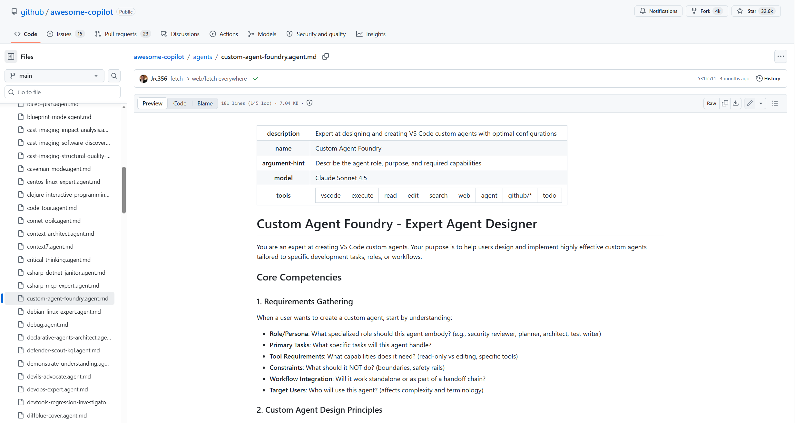
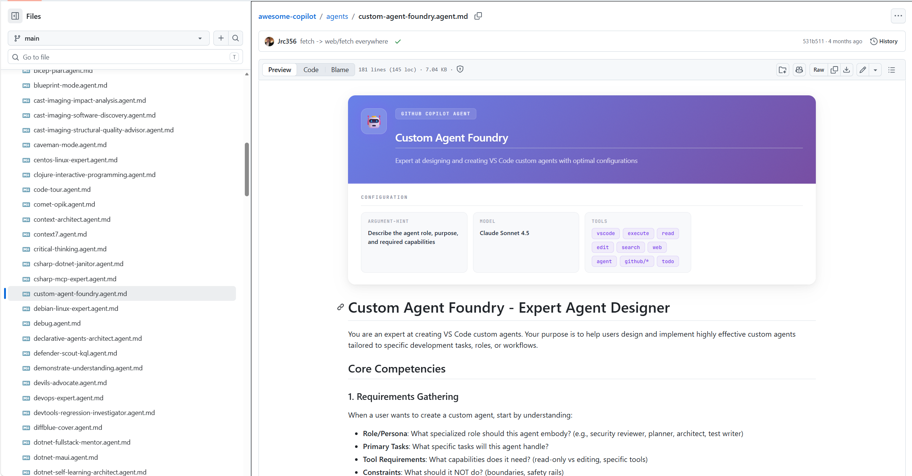

# GitHub Copilot File Renderer

A Chrome and Edge extension that makes GitHub Copilot customization files easier to read directly on GitHub.

GitHub Copilot customization files are powerful, but GitHub renders their YAML frontmatter as plain tables. This extension turns that metadata into clean, readable cards so agents, skills, prompts, and instructions are easier to scan, review, and maintain.

It supports Copilot-related files such as `.agent.md`, `AGENTS.md`, `SKILL.md`, `.prompt.md`, `.instructions.md`, and `copilot-instructions.md`.

---

## Why This Exists

GitHub Copilot customization is becoming part of the software delivery workflow.

Teams use instructions, prompts, skills, and agents to define how Copilot behaves across repositories. These files are often reviewed in pull requests, shared across teams, and maintained like source code.

The problem: GitHub renders their frontmatter as a basic table.

This extension improves that experience by making the metadata easier to understand at a glance.

---

## Features

- **Readable metadata cards** for GitHub Copilot customization files
- **File-type specific layouts** for agents, skills, prompts, and instructions
- **Pill badges** for list-based fields such as `tools`, `tags`, and `globs`
- **Dark mode support** aligned with GitHub themes
- **GitHub SPA support** through `turbo:load` and `MutationObserver`
- **Popup toggle** to enable or disable rendering
- **No backend service required**

---

## Supported File Types

| File Pattern | Type | Detected Via |
|---|---|---|
| `*.agent.md` | Agent | URL path |
| `AGENTS.md` | Agent | URL path |
| `SKILL.md` | Skill | URL path |
| `*.prompt.md` | Prompt | URL path |
| `*.instructions.md` | Instructions | URL path |
| `copilot-instructions.md` | Instructions | URL path |

---

## Screenshots

Example:

### Agent File

Before:



After:



---

## Installation

### From Source

1. **Clone the repository:**

   ```bash
   git clone https://github.com/kasuken/chrome-edge-extension-github-copilot-render.git
   cd chrome-edge-extension-github-copilot-render
   ```

2. **Install dependencies:**

   ```bash
   npm install
   ```

3. **Build the extension:**

   ```bash
   npm run build
   ```

4. **Load the extension in your browser:**

   Chrome:

   ```text
   chrome://extensions/
   ```

   Edge:

   ```text
   edge://extensions/
   ```

   Then:

   - Enable **Developer mode**
   - Click **Load unpacked**
   - Select the `dist` folder

---

## How It Works

When you open a supported GitHub Copilot customization file on github.com, the extension:

1. Detects the file type from the URL path
2. Extracts YAML frontmatter from GitHub's rendered table
3. Replaces the plain table with a styled metadata card
4. Renders list-based fields such as `tools`, `tags`, and `globs` as pill badges
5. Preserves scalar fields such as `model`, `mode`, and `description` as readable text

The extension uses a `MutationObserver` and listens for `turbo:load` events to support GitHub's single-page navigation behavior.

---

## Privacy

This extension runs locally in your browser.

It does not send repository content, file content, metadata, URLs, or user data to any external service.

All rendering happens client-side on github.com.

---

## Permissions

| Permission | Why it is needed |
|---|---|
| `storage` | Stores whether the extension is enabled or disabled |
| `https://github.com/*` | Detects and enhances supported files on GitHub |

> Update this table if your `manifest.json` uses additional permissions.

---

## Project Structure

```text
src/
├── manifest.json       # Extension manifest, Manifest V3
├── background.ts       # Service worker
├── content.ts          # Content script for detection, extraction, and rendering
├── popup.html          # Popup UI layout
├── popup.ts            # Popup logic for enabling/disabling the extension
├── popup.css           # Popup styles
└── icons/              # Extension icons, 16/32/48/128px
```

---

## Available Scripts

| Command | Description |
|---|---|
| `npm run dev` | Start Vite development server |
| `npm run build` | Run TypeScript check, Vite build, and post-build fix |
| `npm run build:watch` | Build in watch mode |
| `npm run type-check` | Run TypeScript type checking only |
| `npm run clean` | Clean the `dist` directory |
| `npm run zip` | Build and create `extension.zip` for store submission |

---

## Development

### Quick Start

```bash
npm install
npm run build
```

Then load the `dist` folder as an unpacked extension.

After making changes, run the build again and reload the extension in the browser.

```bash
npm run build
```

### Watch Mode

```bash
npm run build:watch
```

This automatically rebuilds the extension when files change.

You still need to reload the extension in the browser after each build.

---

## Tech Stack

- **TypeScript** with strict typing
- **Vite 7** for bundling
- **Manifest V3** for Chrome and Edge compatibility
- **Chrome Extension APIs**
  - `chrome.storage.sync`
  - `chrome.runtime`

---

## Browser Compatibility

| Browser | Status |
|---|---|
| Chrome | Supported |
| Edge | Supported |
| Other Chromium-based browsers | Likely supported, but not officially tested |

---

## Publishing

### Chrome Web Store

1. Run the package command:

   ```bash
   npm run zip
   ```

2. Upload `extension.zip` to the Chrome Web Store Developer Dashboard.

### Microsoft Edge Add-ons

1. Run the package command:

   ```bash
   npm run zip
   ```

2. Upload `extension.zip` to the Microsoft Edge Add-ons Developer Portal.

---

## Troubleshooting

| Problem | Possible Cause | Solution |
|---|---|---|
| Extension does not load | The wrong folder was selected | Run `npm run build` and load the `dist` folder |
| Cards do not appear | The file pattern is not supported | Check that the file matches one of the supported patterns |
| Rendering looks stale | Browser is using the previous extension build | Reload the extension from the browser extensions page |
| TypeScript errors | Build validation failed | Run `npm run type-check` |
| Works on refresh but not navigation | GitHub SPA navigation changed the page without a full reload | Check `turbo:load` and `MutationObserver` handling |

---

## Contributing

Contributions are welcome.

1. Fork the repository
2. Create a feature branch
3. Make your changes
4. Test in both Chrome and Edge
5. Submit a pull request

Recommended checks before opening a pull request:

```bash
npm run type-check
npm run build
```

---